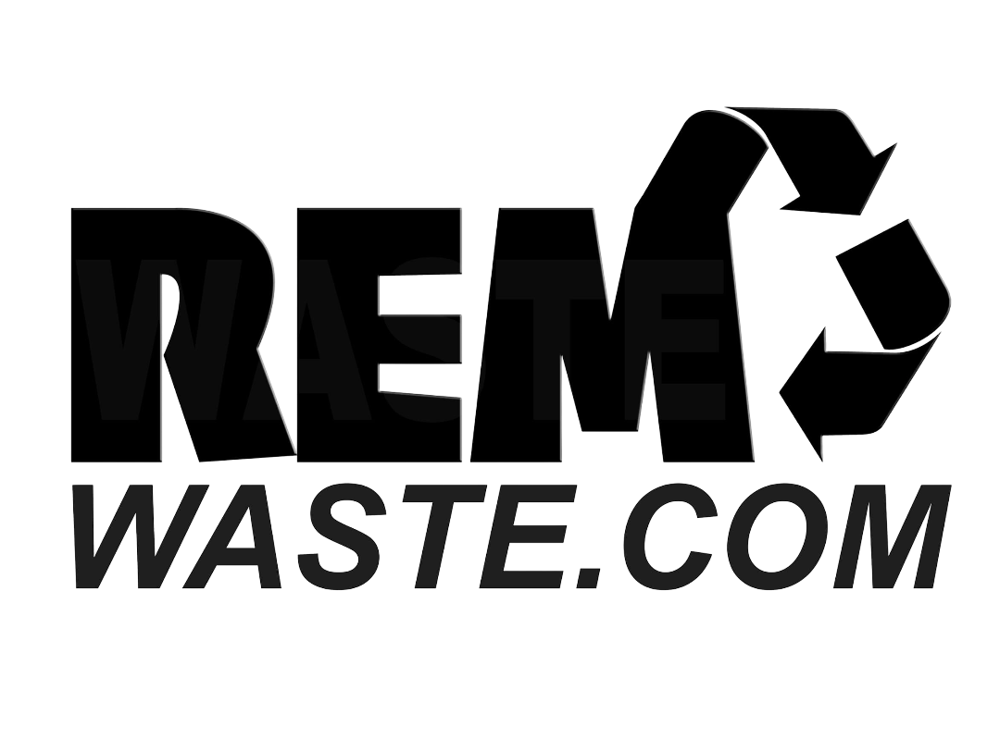

# REMWaste Challenge

**Author:** Yakup Celepi

This project is a demo application prepared for REMWaste. Users can select, filter, and view details of containers (skips). The application is developed with a modern interface and aims for ease of use.

---

## Development Environment Setup

To run the project, you need Node.js and npm installed on your computer. If you don't have them installed, you can download them from the [Node.js website](https://nodejs.org/).

After downloading the project files, open a terminal in the project folder and run:
```sh
npm install
```
To start the project, run:
```sh
npm run dev
```
Then open your browser and go to [http://localhost:5173](http://localhost:5173) to view the project.

---

## Technologies Used

- React
- Vite
- TypeScript
- Tailwind CSS
- ESLint

---

## Folder Structure

The project is organized as follows:

```
frontend/                Root folder of the project
│
├── public/              Static files (images, favicon, etc.)
│   └── images/          Container images used in the project
│
├── src/                 Main source code
│   ├── assets/          Images, icons, and other resources
│   ├── components/      Reusable UI components
│   ├── hooks/           Custom React hooks
│   ├── pages/           Page components
│   ├── service/         API and data services
│   ├── types/           TypeScript type definitions
│   ├── App.tsx          Main application component
│   ├── main.tsx         Entry point of the application
│   └── vite-env.d.ts    Type definitions for Vite
│
├── package.json         Project dependencies and scripts
├── tsconfig.json        TypeScript configuration
├── vite.config.ts       Vite configuration
└── README.md            Project documentation
```

---

## Additional Notes

- All API requests are defined in the `src/service/` folder.
- Tailwind CSS is used to provide a modern and responsive interface.
- Vite offers a fast development and build experience.
- ESLint ensures code quality and consistency.

If you encounter any issues or would like to contribute, please open an issue or submit a pull request.
